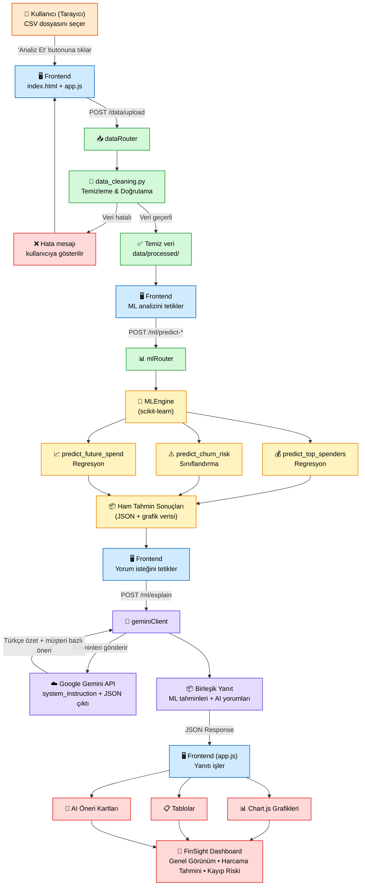

# 🚀 FinSight (Finans Öngörüsü) AI Eğitim Programı
### Python, Makine Öğrenmesi, FastAPI ve Gemini AI ile Uçtan Uca Finansal Zeka Platformu Geliştirme

---

## 📋 Program Özeti

| Bilgi | Detay |
|---|---|
| Toplam Süre | 18 saat |
| Oturum Sayısı | 6 oturum (oturum başına 3 saat) |
| Format | Teori + canlı kodlama + bitirme projesi inşası (her oturum projeye bir kat ekler) |
| Hedef Kitle | Python temellerine sahip, veri bilimi / AI mühendisliğine geçiş yapmak isteyen öğrenciler |
| Önkoşullar | Temel Python (fonksiyon, sınıf, döngü), temel terminal/Git kullanımı |
| Ana Teknolojiler | Python, pandas, scikit-learn, matplotlib/seaborn, FastAPI, Pydantic, Google Gemini API, HTML/CSS/JS, Chart.js |

**Pedagojik yaklaşım:** Her oturum iki katmandan oluşur — (1) o oturumun konusuna özel kavramsal anlatım + küçük alıştırmalar, (2) o kavramların doğrudan **bitirme projesinin ilgili fazına** uygulanması. Böylece öğrenciler hem konuyu izole olarak pekiştirir hem de oturum sonunda elinde çalışan, bir önceki oturuma eklenen somut bir proje parçası kalır. 6. oturumun sonunda öğrencinin elinde uçtan uca çalışan bir ürün olur.

---

## 🎯 Eğitim Hedefleri

Program sonunda öğrenciler şunları yapabilecek:

- Ham, dağınık bir CSV veri setini analiz edilebilir hale getirmek (temizleme, tip dönüşümü, eksik veri yönetimi)
- pandas ile keşifsel veri analizi (EDA) yapmak ve matplotlib/seaborn ile içgörüyü görselleştirmek
- RFM (Recency, Frequency, Monetary) mantığıyla müşteri segmentasyonu kurgulamak
- scikit-learn ile regresyon (harcama tahmini) ve sınıflandırma (kayıp/churn riski tahmini) modelleri eğitmek ve değerlendirmek
- FastAPI ile router tabanlı, Pydantic doğrulamalı bir REST API tasarlamak
- Google Gemini API'yi sistem talimatı (system instruction) ve yapılandırılmış JSON çıktısıyla bir backend servisine entegre etmek
- ML çıktılarını Gemini ile "insan diliyle açıklanan içgörüye" dönüştürmek
- Tek sayfalık bir HTML/JS arayüzde dosya yükleme, API çağrısı, grafik ve tablo gösterimini bir araya getirmek
- Tüm bu parçaları tek bir uçtan uca çalışan üründe birleştirmek

---

## 🏆 Bitirme Projesi Tanıtımı: FinSight AI

> **"Verinizi yükleyin, yapay zeka geri kalanını konuşsun."**

**FinSight AI**, bir e-ticaret/perakende işletme sahibinin satış verisini (CSV) yüklediği; sistemin makine öğrenmesi ile müşteri davranışını, harcama eğilimlerini ve kayıp riskini tahmin ettiği; Google Gemini'nin bu sayısal tahminleri anlaşılır, Türkçe, aksiyon alınabilir içgörülere çevirdiği ve sonuçların grafik/tablo halinde tek bir dashboard'da sunulduğu uçtan uca bir finansal zeka platformudur.

Bu doküman, projeyi **6 faza** bölerek, her fazı ilgili eğitim oturumuyla eşleştirir. Detaylı teknik şartname dokümanın ikinci yarısındadır.

---

## 📅 Oturum Planı (6 × 3 Saat = 18 Saat)

### 🔹 Oturum 1 — Veriyle Tanışma ve Veri Hazırlığı *(Faz 1)*
**Süre:** 3 saat

**Konular:**
- Python/pandas hız turu: DataFrame, Series, indexleme, filtreleme
- CSV okuma/yazma, encoding sorunları (Türkçe karakterler: İ/ı/ş/ğ)
- Eksik veri tespiti ve stratejileri (dropna, fillna)
- Tarih-saat dönüşümü (`pd.to_datetime`, format string'leri)
- Aykırı değer (outlier) tespiti, tip dönüşümleri
- Veri doğrulama mantığı (zorunlu kolonlar, negatif değerler, mantıksız tarihler)

**Pratik Alıştırma:**
Kasıtlı olarak "kirli" bırakılmış örnek bir `siparisler_raw.csv` (eksik hücreler, bozuk tarih formatları, karışık şehir isimleri — "İzmi̇r" gibi) öğrencilere verilir; `siparisler_cleaned.csv` haline getirilir.

**Proje Bağlantısı (Faz 1 — Veri Katmanı):**
- `data/raw/` ve `data/processed/` klasör yapısının kurulması
- `data_cleaning.py`: ham veriyi temizleyip standart şemaya çeviren script
- Beklenen kolon şeması: `siparis_id, musteri_adi, sehir, fiyat, adet, tarih, kategori, toplam_harcama`

**Oturum Sonu Çıktısı:** Temiz, doğrulanmış bir CSV + tekrar kullanılabilir temizleme fonksiyonu.

---

### 🔹 Oturum 2 — Keşifsel Veri Analizi ve Görselleştirme *(Faz 2)*
**Süre:** 3 saat

**Konular:**
- `groupby`, `agg`, `pivot_table` ile özetleme
- matplotlib ve seaborn temelleri (bar, line, heatmap)
- Zaman serisi görünümü: aylık/haftalık satış trendi
- Kategori ve şehir bazlı kırılımlar
- RFM analizine giriş: Recency (yenilik), Frequency (sıklık), Monetary (parasal değer) kavramları
- "İyi bir grafik" prensipleri: başlık, eksen etiketleri, renk paleti seçimi

**Pratik Alıştırma:**
Temizlenmiş veri üzerinde: en çok harcayan 10 müşteri, kategori bazlı ortalama sepet tutarı, şehir bazlı toplam satış grafikleri.

**Proje Bağlantısı (Faz 2 — Analiz Katmanı):**
- `analytics.py`: RFM tablosu üreten fonksiyon (`musteri_adi, frequency, monetary, recency`)
- En az 3 görsel üreten ve PNG olarak `data/processed/` altına kaydeden fonksiyonlar (kategori dağılımı, müşteri harcama sıralaması, zaman trendi)

**Oturum Sonu Çıktısı:** RFM tablosu + üç adet kaydedilmiş grafik.

---

### 🔹 Oturum 3 — Makine Öğrenmesi: Regresyon ve Sınıflandırma *(Faz 3)*
**Süre:** 3 saat

**Konular:**
- `train_test_split`, eğitim/test ayrımının önemi
- `LinearRegression` ve `RandomForestRegressor` ile harcama tahmini
- Model değerlendirme: R², MAE — ne işe yarar, nasıl yorumlanır
- `RandomForestClassifier` ile ikili sınıflandırma (kayıp riski / churn)
- Sınıflandırma metrikleri: accuracy, precision, recall — neden tek başına accuracy yetmez
- `predict_proba` ile olasılık tabanlı tahmin ve risk skoru üretme
- Özellik mühendisliği (feature engineering): RFM tablosundan model girdisi türetme
- Overfitting kavramı ve basit önlemler

**Pratik Alıştırma:**
Verilen RFM tablosundan: (a) gelecek dönem harcama tahmini yapan bir regresyon modeli, (b) "30 gün içinde tekrar alışveriş yapmama olasılığı" tahmin eden bir sınıflandırma modeli kurulur.

**Proje Bağlantısı (Faz 3 — ML Katmanı):**
- `ml_engine.py` içinde `MLEngine` sınıfı:
  - `predict_top_spenders(df)` → önümüzdeki dönemde en çok harcayacak 5 müşteri
  - `predict_churn_risk(df)` → kayıp riski en yüksek 5 müşteri + olasılık skoru
  - `predict_future_spend(df)` → genel/segment bazlı gelecek harcama tahmini
- Her fonksiyon hem ham tahmin verisini (dict/JSON) hem de ilgili grafiği üretir

**Oturum Sonu Çıktısı:** Çalışan `MLEngine` sınıfı + üç tahmin fonksiyonu + görseller.

---

### 🔹 Oturum 4 — Backend API Geliştirme: FastAPI *(Faz 4)*
**Süre:** 3 saat

**Konular:**
- FastAPI temelleri: path operation, async/sync, otomatik dokümantasyon (`/docs`)
- Pydantic modelleri ile istek/yanıt doğrulama
- Router mimarisi: işlevsel modüllere bölme (`mlRouter`, `userRouter`, `dataRouter`)
- Dosya yükleme: `UploadFile`, CSV'yi belleğe/diske alma
- CORS middleware, neden gerekli
- Hata yönetimi: özel exception handler'lar, anlamlı HTTP durum kodları
- Ortam değişkenleri ile yapılandırma (`config.py`, `.env`)

**Pratik Alıştırma:**
CSV dosyası kabul eden, temizleyen ve geçici olarak saklayan bir `/data/upload` endpoint'i; ardından bu veriyi `MLEngine`'e iletip sonucu JSON olarak döndüren bir `/ml/predict` endpoint'i.

**Proje Bağlantısı (Faz 4 — API Katmanı):**
- `main.py`: FastAPI app, CORS, router include
- `routes/dataRouter.py`: `POST /data/upload`
- `routes/mlRouter.py`: `POST /ml/predict-top-spenders`, `POST /ml/predict-churn`, `POST /ml/predict-future-spend`
- `models.py`: `UploadResponse`, `PredictionResponse`, `ErrorResponse` Pydantic şemaları
- Genel `try/except` + standart hata formatı

**Oturum Sonu Çıktısı:** `/docs` üzerinden test edilebilen, çalışan API; Postman/Swagger ile uçtan uca CSV → tahmin akışı.

---

### 🔹 Oturum 5 — Gemini AI Entegrasyonu *(Faz 5)*
**Süre:** 3 saat

**Konular:**
- Gemini API kurulumu, API anahtarı yönetimi (asla koda gömmeme, `.env` kullanımı)
- `system_instruction` ile modelin rolünü ve kısıtlarını tanımlama
- Yapılandırılmış (structured) JSON çıktısı talep etme ve güvenli parse etme
- Prompt mühendisliği: net kurallar, örnek format, dil/ton talimatları (Türkçe çıktı)
- Sayısal ML çıktısını (örn. "Ayşe Kaya: churn olasılığı %78") doğal dile çevirme stratejisi
- Hata toleransı: Gemini geçersiz JSON döndürürse ne yapılır (retry, fallback, markdown temizleme)
- Basit önbellekleme (caching) ile gereksiz API çağrısını azaltma

**Pratik Alıştırma:**
Bir önceki oturumda üretilen "kayıp riski en yüksek 5 müşteri" listesini Gemini'ye gönderip, her müşteri için kısa, aksiyon önerili bir Türkçe açıklama ("Bu müşteriye özel %10 indirim kampanyası önerilir, çünkü...") ürettirme.

**Proje Bağlantısı (Faz 5 — AI Yorumlama Katmanı):**
- `gemini_client.py`:
  - `explain_predictions(prediction_type, data)` → ML çıktısını alıp yapılandırılmış JSON içinde özet + müşteri bazlı yorum + öneri döndürür
  - Sistem talimatında zorunlu alanlar: `genel_ozet`, `musteri_yorumlari[]` (her biri `musteri_adi`, `yorum`, `onerilen_aksiyon`)
- `/ml/explain` endpoint'i: ML sonucunu alır, Gemini'den yorum ister, birleştirilmiş yanıtı döner

**Oturum Sonu Çıktısı:** ML tahminlerinin yanında Gemini tarafından üretilmiş, müşteri bazlı Türkçe içgörü ve öneri metinleri.

---

### 🔹 Oturum 6 — Frontend Entegrasyonu, Görselleştirme ve Sunum *(Faz 6)*
**Süre:** 3 saat

**Konular:**
- Tek sayfa (single-page) HTML/CSS/JS mimarisi — framework'süz, sade yaklaşım
- `fetch` ile API çağrısı, `FormData` ile dosya yükleme
- Chart.js ile dinamik grafik çizimi (bar, line, doughnut)
- Tablo render etme, yükleniyor (loading) durumları, hata mesajı gösterimi
- Backend'den gelen Gemini yorumlarını okunabilir kart (card) bileşenlerinde sunma
- Temel UX prensipleri: kullanıcıyı bekletmeme, adım adım ilerleme göstergesi
- Uçtan uca test: CSV yükle → temizleme → ML → Gemini → ekranda sonuç

**Pratik Alıştırma:**
Statik bir JSON ile (backend olmadan) Chart.js grafiği ve kart bileşenleri oluşturma; ardından gerçek API'ye bağlama.

**Proje Bağlantısı (Faz 6 — Arayüz Katmanı, FİNAL ENTEGRASYON):**
- `templates/index.html`: CSV yükleme formu, "Analiz Et" butonu, sonuç bölümü
- `static/app.js`: API çağrıları, state yönetimi, Chart.js grafik render
- `static/style.css`: sade, okunabilir bir dashboard teması
- Üç sekme/bölüm: (1) Genel Satış Görünümü, (2) Gelecek Harcama Tahmini, (3) Kayıp Riski & AI Önerileri

**Oturum Sonu Çıktısı:** Uçtan uca çalışan FinSight AI — CSV yükle, birkaç saniye bekle, grafik + tablo + AI yorumlarını gör.

---

## 🏗️ Bitirme Projesi — Detaylı Teknik Şartname

### Proje Adı
**FinSight AI — Akıllı Satış ve Müşteri İçgörü Platformu**

### Problem Tanımı
Küçük/orta ölçekli bir e-ticaret işletmesi sahibi, ham satış verisini (CSV) elinde tutar ama bu veriden anlamlı, aksiyon alınabilir sonuç çıkaracak zamanı veya teknik bilgisi yoktur. FinSight AI, bu veriyi yükler yüklemez otomatik olarak temizler, makine öğrenmesiyle tahminler üretir, Gemini ile bu tahminleri sade Türkçe içgörülere çevirir ve sonucu görsel bir dashboard'da sunar.

### Kullanıcı Senaryosu
1. Kullanıcı ana sayfada "CSV Yükle" butonuna tıklar, satış verisini seçer.
2. Sistem veriyi temizler ve doğrular; hatalıysa kullanıcıyı bilgilendirir.
3. Sistem üç ML modelini çalıştırır: en çok harcayacak müşteriler, kayıp riski yüksek müşteriler, gelecek dönem toplam harcama tahmini.
4. Sistem bu tahminleri Gemini API'ye gönderir, Türkçe özet ve müşteri bazlı öneriler alır.
5. Sonuçlar dashboard'da grafik + tablo + AI yorum kartları halinde gösterilir.

### Sistem Mimarisi (Akış)



> **Not:** Bu diyagram Mermaid formatındadır. GitHub, VS Code, Obsidian, Claude gibi Mermaid destekleyen görüntüleyicilerde otomatik olarak görsel akış şeması şeklinde render edilir. Renk kodları proje fazlarıyla eşleşir: turuncu = kullanıcı, mavi = frontend, yeşil = backend/API, sarı = ML katmanı, mor = Gemini AI katmanı, kırmızı = arayüze dönen çıktı.

### Önerilen Klasör Yapısı
```
finsight-ai/
├── app/
│   ├── main.py
│   ├── config.py
│   ├── models.py
│   ├── data_cleaning.py
│   ├── analytics.py
│   ├── ml_engine.py
│   ├── gemini_client.py
│   └── routes/
│       ├── dataRouter.py
│       ├── mlRouter.py
│       └── userRouter.py
├── data/
│   ├── raw/
│   └── processed/
├── templates/
│   └── index.html
├── static/
│   ├── app.js
│   └── style.css
├── .env
├── requirements.txt
└── README.md
```

### Veri Seti Şartnamesi
Minimum kolon şeması (öğrenciler isterlerse ek kolon türetebilir):

| Kolon              | Tip      | Açıklama                               |
| ------------------ | -------- | -------------------------------------- |
| `siparis_id`       | int      | Benzersiz sipariş numarası             |
| `musteri_id`       | int      | Benzersiz müşteri numarası             |
| `musteri_adi`      | string   | Müşteri adı                            |
| `cinsiyet`         | string   | Erkek / Kadın                          |
| `yas`              | int      | Müşteri yaşı                           |
| `sehir`            | string   | Sipariş edilen şehir                   |
| `ilce`             | string   | İlçe bilgisi                           |
| `urun_id`          | int      | Ürün numarası                          |
| `urun_adi`         | string   | Ürün adı                               |
| `kategori`         | string   | Ürün kategorisi                        |
| `marka`            | string   | Ürün markası                           |
| `fiyat`            | float    | Birim fiyat                            |
| `adet`             | int      | Satın alınan ürün miktarı              |
| `indirim_orani`    | float    | Uygulanan indirim yüzdesi              |
| `kargo_ucreti`     | float    | Kargo bedeli                           |
| `odeme_tipi`       | string   | Kredi Kartı, Havale, Kapıda Ödeme vb.  |
| `siparis_durumu`   | string   | Tamamlandı, İptal, İade                |
| `tarih`            | datetime | Sipariş tarihi (`gg-aa-yyyy ss:dd:ss`) |
| `teslim_tarihi`    | datetime | Sipariş teslim tarihi                  |
| `toplam_harcama`   | float    | `(fiyat × adet) - indirim + kargo`     |
| `musteri_puani`    | float    | Müşteri memnuniyet puanı (1-5)         |
| `sadakat_seviyesi` | string   | Bronze, Silver, Gold, Platinum         |
| `kampanya_kodu`    | string   | Kullanılan kampanya kodu               |
| `urun_puani`       | float    | Ürün değerlendirme puanı               |
| `yorum_sayisi`     | int      | Ürüne yapılan yorum sayısı             |

### Faz Faz Gereksinimler ve Teslim Kriterleri

**Faz 1 — Veri Hazırlığı**
- [ ] Ham veri başarıyla okunuyor, Türkçe karakter sorunları çözülmüş
- [ ] Eksik/hatalı satırlar uygun stratejiyle ele alınmış (silinmiş veya doldurulmuş, gerekçesi belirtilmiş)
- [ ] Tarih kolonu doğru tipe çevrilmiş
- [ ] Temizlenmiş veri `data/processed/` altında kaydediliyor

**Faz 2 — Analiz ve Görselleştirme**
- [ ] RFM tablosu doğru hesaplanıyor (frequency, monetary, recency)
- [ ] En az 3 anlamlı, etiketli, okunabilir grafik üretiliyor
- [ ] Grafikler dosyaya kaydediliyor ve API'den erişilebilir

**Faz 3 — Makine Öğrenmesi**
- [ ] En az bir regresyon modeli (harcama tahmini) çalışıyor ve R² skoru raporlanıyor
- [ ] En az bir sınıflandırma modeli (churn riski) çalışıyor, olasılık skoru üretiyor
- [ ] Eğitim/test ayrımı doğru yapılmış, overfitting'e karşı en az bir önlem tartışılmış
- [ ] Model çıktıları JSON'a dönüştürülebiliyor

**Faz 4 — Backend API**
- [ ] `/docs` üzerinden tüm endpoint'ler test edilebiliyor
- [ ] İstek/yanıtlar Pydantic ile doğrulanıyor
- [ ] Hatalı dosya/veri durumunda anlamlı hata mesajı dönüyor (500 yerine 4xx)
- [ ] CORS doğru yapılandırılmış

**Faz 5 — Gemini Entegrasyonu**
- [ ] Gemini'den dönen yanıt güvenli şekilde JSON'a parse ediliyor (markdown temizleme dahil)
- [ ] Sistem talimatı net, tutarlı Türkçe çıktı üretiyor
- [ ] En az 3 müşteri için kişiselleştirilmiş yorum + öneri üretiliyor
- [ ] API anahtarı `.env` üzerinden okunuyor, koda gömülmemiş

**Faz 6 — Frontend & Entegrasyon**
- [ ] CSV yükleme → sonuç gösterimi tek akışta çalışıyor
- [ ] En az 2 farklı grafik tipi (örn. bar + line/doughnut) gösteriliyor
- [ ] Yükleniyor durumu ve hata mesajları kullanıcıya gösteriliyor
- [ ] AI yorumları okunabilir kartlarda sunuluyor

### Değerlendirme Kriterleri (Rubrik)

| Kriter | Ağırlık |
|---|---|
| Veri temizleme kalitesi ve doğruluğu | %15 |
| ML modellerinin doğru kurgulanması ve değerlendirilmesi | %25 |
| API tasarımı (yapı, hata yönetimi, dokümantasyon) | %20 |
| Gemini entegrasyonu (prompt kalitesi, çıktı tutarlılığı) | %20 |
| Frontend kullanılabilirliği ve görsel sunum | %15 |
| Kod okunabilirliği, klasör yapısı, README | %5 |

### 🎁 Bonus Özellikler (opsiyonel, ek puan)
- Birden fazla CSV şemasını otomatik algılayan esnek bir veri eşleme katmanı
- Sonuçları PDF rapor olarak indirme
- Basit kullanıcı girişi / oturum yönetimi (`userRouter` genişletmesi)
- Gemini yanıtları için disk/Redis tabanlı önbellekleme
- Segment bazlı (VIP / Riskli / Yeni) müşteri etiketleme ve renk kodlu görselleştirme
- Modelin tahmin güven aralığını da göstermesi

### Sunum ve Teslim Formatı
- Çalışan kodun repo bağlantısı (README'de kurulum adımları)
- 5-10 dakikalık canlı demo: CSV yükleme → uçtan uca sonuç
- Kısa bir teknik sunum: hangi modeller seçildi, neden; Gemini prompt tasarımı nasıl yapıldı
- Karşılaşılan en az 1 teknik zorluk ve çözümü

---

## 📚 Ek Kaynaklar
- pandas resmi dokümantasyonu — veri temizleme ve `groupby` rehberleri
- scikit-learn "Model evaluation" bölümü — R², precision/recall açıklamaları
- FastAPI resmi dokümantasyonu — özellikle "Bigger Applications / Multiple Files" rehberi
- Google Gemini API dokümantasyonu — `system_instruction` ve structured output örnekleri
- Chart.js resmi örnekleri — bar/line/doughnut grafik şablonları

---

*Bu doküman, eğitmenin oturum içeriklerini ve örnek kod parçalarını detaylandırması için bir iskelet niteliğindedir. Her oturumdaki "Pratik Alıştırma" ve "Proje Bağlantısı" bölümleri, eğitmenin canlı kodlama materyaliyle doldurulmak üzere bilinçli olarak yüksek seviyede bırakılmıştır.*
